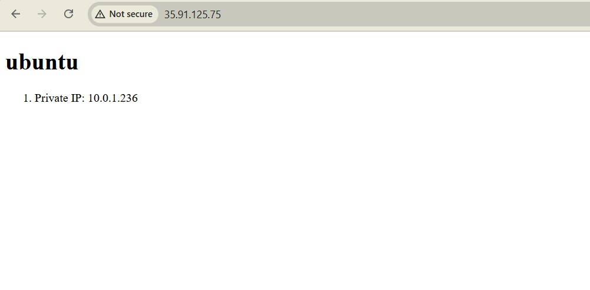

# 4640-ansible-roles-lab


1.. **Run Terraform to create servers:**
   ```bash
   cd terraform
   terraform init
   terraform apply
   ```

2. ## Running Ansible

From the `ansible` directory, run:

```bash
ansible-playbook -i inventory/aws_ec2.yml playbook.yml
```


